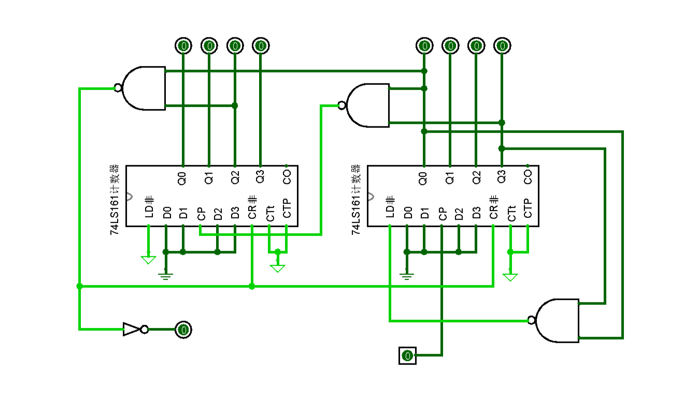

## 设计并实现计时长度为60秒的秒表，计时单位为百分秒。

### 一、logisim:

##### 1.分频器的实现：

​		设定输入时钟信号为4.1KHz，设计分频器，产生百分秒输出时钟信号；

​		首先看分频器在整个电路中的作用，秒表计时低位从百分秒开始计，因此需要百分秒周期的信号输入，既100Hz的时钟信号，要将logisim输入的4.1KHz分频为100Hz，可知需要设置分频系数为1/41的分频器，对原频率进行41分频。

​		分频器由计数器组成，首先需要设计带有进位功能的模41计数器:



​		如图为logisim中设计的模41计数器，采用两片封装的74161进行级联，低位片采用置数法构成模10计数器，每计10个数通过与非门向高位片产生CP信号，使高位片计1。当高位片计到4低位片计到1时通过与非门产生低电位作用于CR非进行整体清零，并同时产生一个向高位的进位信号。由此构成了从0计到40的模41计数器。

​                                                		

​		以4分频为例，原输入频率通过m4计数器产生的进位信号波形如图所示，要进位4分频，必须在每个进位信号时使得输出信号反转，如图CLK_OUT波形所示。


​		然后需要设计两个计数相同的计数器，一个由上升沿驱动，一个由下降沿驱动，将输出信号进行或运算，既可以得到50％占空比的奇数分频器。设计的电路如下图所示：


​		将前面设计的模41计数器进行封装，将它的进位输出连接到JK触发器的CP端，JK触发器的JK端同时接高电平，这样就实现了每当计数器计满输出进位信号使得JK触发器的输出进行翻转。


​		上下两个M41计数器，本身为上升沿触发方式，给下面的计数器输入端添加了非门构成了下降沿触发的计数器。最后将上下两个输出信号通过或门，构成了输出信号为50％占空比的奇数分频器。 最后将logisim中分频器进行封装，如上边右图所示。

##### 2.M100计数器的实现：

​		设计模100的BCD码计数器，以百分秒时钟为输入，产生秒信号（1Hz）输出；

​		首先在logisim中设计74161计数器。将74161封装，加载到主电路中进行级联：


​		设计的带有进位功能的M100 BCD码计数器如图所示，两个74161进行级联，低位片使用反馈置数法构成模10计数器，低位片每计数10次向高位片发送CP信号，使高位片计1，当低位片记到9产生进位使高位片正好为10时通过3输入与非门产生了低电位的清零信号，作用于两片74161的CR非，使整体清零，同时通过非门产生了一个进位信号，构成了带走进位功能的M100 BCD码计数器。

##### 3.M60计数器的实现：

​		设计模60的BCD码计数器，进行60秒计数；


​		设计的M60计数器如图所示，使用了前面封装的74161计数器，低位片采用置数法，计数到9时置数为0，同时通过与非门向高位产生CP信号使高位片计1，当低位片计数到9进位使高位片正好为6时通过3输入与非门产生了低电平清零信号，作用于两片76161的CR非，使计数清零，再开始下一轮计数，构成了M60的BCD码计数器。

##### 4.七段共阴驱动的实现：

使用logisim的真值表功能构建电路如图：


封装后连接七段数码管测试：


##### 5.所有模块完成之后，进行总装:

​		4.1KHz时钟信号输入通过41分频器进行分频，输出100Hz时钟信号到M100计数器，M100计数器计数满后向M60计数器进位。M100BCD码计数器通过两片七段共阴驱动连接两片七段数码管，表示百分秒计时。M60BCD码计数器通过两片七段共阴驱动连接两片七段数码管，表示秒钟计时。

​		最后点击logisim菜单栏的模拟—>时钟频率设为4.1KHZ—>启用时钟模拟，秒表就跑起来了：


​		logisim使用了41分频的分频器，但实际测试中发现计时速度很慢，没有达到正常秒表的计时速度，分析原因为logisim软件自身产生的输入频率不对，远远没有达到4.1KHz，本质上可能是与电脑自身产生的时钟频率有关。采用的解决方案为，从41开始不断降低分频数，当降到6分频时，秒表工作速度接近正常。

### 二、quartus:

##### 1.分频器的实现：

​		选择50MHz的时钟频率作为输入，秒表需要的时钟频率为100Hz，因此需要进行500000分频。首先，通过verilog代码完成quartus下的N分频的分频器：

```verilog
module experiment4 //N分频器(fre_div)
    (
    input clk,
    input rst_p,
    output reg clk_out
    );

// 参数 ：位宽和分频系数
parameter width = 4;
parameter N = 5;
reg [width-1:0] cnt;

// count edge
always @(posedge clk or posedge rst_p) 
begin
    if(rst_p)
    begin
        cnt<=0;
        clk_out<=1'b0;
    end
else if(cnt==N-1)
begin
    clk_out<=~clk_out;
    cnt<=0;
end
else   
    cnt<=cnt+1;
end
endmodule
```
​		代码如图所示，通过parameter设置了参数N，可以通过修改N的值来改变分频器的分频系数，将文件封装成子电路加入到电路图中：


​		由于500000分频数字非常庞大，因此我采用了多个分频器级联的方法。如上图所示，第一个分频器分频系数为1/5，后面连接的五个分频器分频系数为1/10，通过这样的级联构成了分频系数为1/500000的分频器。

​		最后将分频器封装成子电路：


##### 2.M100计数器的实现：


仿真:


​		从波形图可以观察到，低位每一个周期相当于高位的半个周期，从qout0到qout7都满足这一情况，当计数器从0计数到99时，再来一个CP信号，计数器清零，开始下一轮的计数，计数器工作正常。

##### 3.M60计数器的实现:


#####  4.七段共阴驱动的实现:

````verilog
module cy4(input LE,BL,LT,//输入端口声明
           input D3,D2,D1,D0,//输入端口声明
           output reg a,b,c,d,e,f,g//输出端口及变量的数据类型声明
           );
always @(*)
begin
  if(LT == 1) {a,b,c,d,e,f,g} = 7'b111_1111;//让显示器的7段都发光,显示8
  else if(BL == 1) {a,b,c,d,e,f,g} = 7'b000_0000;//让显示器的7段都熄灭,显示0
  else if(LE == 1) {a,b,c,d,e,f,g} = {a,b,c,d,e,f,g};//锁存显示
  else
    case({D3,D2,D1,D0})//根据输入的8421BCD码,实现显示译码器的功能
    4'd0: {a,b,c,d,e,f,g} <= 7'b111_1110;
    4'd1: {a,b,c,d,e,f,g} <= 7'b011_0000;
    4'd2: {a,b,c,d,e,f,g} <= 7'b110_1101;
    4'd3: {a,b,c,d,e,f,g} <= 7'b111_1001;
    4'd4: {a,b,c,d,e,f,g} <= 7'b011_0011;
    4'd5: {a,b,c,d,e,f,g} <= 7'b101_1011;
    4'd6: {a,b,c,d,e,f,g} <= 7'b001_1111;
    4'd7: {a,b,c,d,e,f,g} <= 7'b111_0000;
    4'd8: {a,b,c,d,e,f,g} <= 7'b111_1111;
    4'd9: {a,b,c,d,e,f,g} <= 7'b111_1011;
    default: {a,b,c,d,e,f,g} <= 7'b000_0000;//非8421BCD码输入时,不显示
    endcase
end
endmodule
````

电路封装：


##### 5.所有模块完成之后，进行总装：


quartus仿真：


​		结合数码管构造来看，当第三个数码管的abcdef为011000就表示计时到一秒钟，观察和第三个数码管连接的s1s2s3s4s5s6s7的波形。


​		如上图所示，0.1纳秒的CP输入，当仿真波形到10纳秒时正有第三个数码管s1s2s3s4s5s6s7=0110000，表示数字1，既计时到1秒。其他三个数码管道理相同，电路工作非常完美。

#### 三、扩展：

计数与分频有什么区别？

​		分频器的时钟脉冲CP一定是周期信号，则输出信号也是周期性，输出信号的周期是输入信号周期的M倍，反过来输出信号的频率是输入信号频率的M分之一。分频器的目的是通过分频产生需要的频率信号来给电路使用。

​		计数器的时钟脉冲CP不一定是周期信号，可以是随机脉冲，称为计数脉冲，则输出信号也不一定是周期性。计数器工作目的是纪录计数脉冲个数（递加或递减）以及产生溢出（进位或借位）信号。